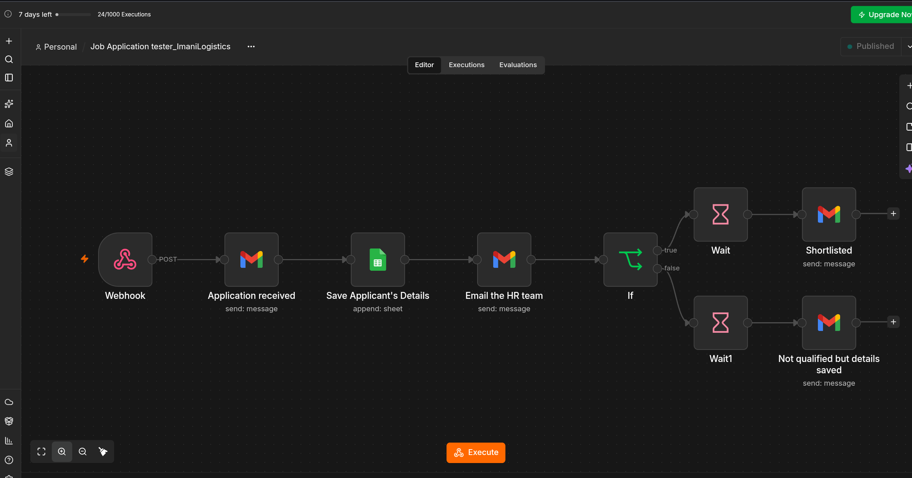

# Automated Recruitment Workflow

An end-to-end recruitment automation workflow built with n8n to reduce repetitive manual work involved in collecting, processing, tracking, and communicating with job applicants.

## Project Overview

This project simulates a recruitment workflow for a company hiring for multiple positions.

The goal was to automate the process from the moment a candidate submits an application through candidate data management and follow-up communication.

## Problem

Recruitment teams often spend time manually:

* Collecting candidate applications
* Transferring candidate information into spreadsheets
* Reviewing and categorizing applications
* Updating candidate statuses
* Sending interview or rejection emails
* Keeping recruitment records organized

This workflow automates several of these repetitive steps.

## Workflow

```text
Candidate
    ↓
Fillout Application Form
    ↓
Webhook
    ↓
n8n Workflow
    ↓
Process Candidate Data
    ↓
Google Sheets
    ↓
Candidate Evaluation / Routing
    ↓
┌───────────────────────┐
│                       │
Interview              Rejection
Invitation              Email
│                       │
└───────────────────────┘
```

## Tools & Technologies

* n8n
* Fillout
* Webhooks
* JSON
* Google Sheets
* Gmail
* Conditional logic
* Workflow automation

## What the Workflow Does

1. Receives a candidate's application through a Fillout form.
2. Sends the submitted data to n8n through a webhook.
3. Processes and organizes the candidate information.
4. Stores the application data in Google Sheets.
5. Uses workflow logic to determine the appropriate candidate path.
6. Updates the candidate's recruitment status.
7. Sends the appropriate email communication.
8. Keeps the recruitment information organized for further processing.

## Key Automation Concepts Demonstrated

### Webhooks

The workflow uses a webhook to receive application data from the external form and trigger the automation.

### Data Processing

Candidate information is received as structured data and processed within the workflow before being passed to subsequent steps.

### Conditional Logic

Different candidate outcomes are handled through workflow conditions, allowing candidates to follow different paths based on the defined criteria.

### Automated Communication

Gmail is used to send candidate communications automatically based on the workflow outcome.

### Data Management

Google Sheets is used as a structured record of submitted applications and recruitment status.

## Challenges & Troubleshooting

During development, I worked through issues involving webhook testing, receiving form data correctly, reconnecting integrations, and ensuring that information was passed between workflow steps as expected.

This helped me develop practical experience with testing, debugging, and troubleshooting automation workflows.

## Future Improvements

Possible improvements include:

* AI-assisted candidate screening
* CV/document processing
* Automated interview scheduling
* Delayed candidate communication
* CRM integration
* Candidate scoring
* Automated recruitment analytics
* Error notifications and workflow monitoring

## Project Status

Completed as a practical automation project and continuously being improved as I develop my skills in AI and workflow automation.

## Training & Certifications

### Make Academy

**AI Automation Explorer — Automation to AI Agents Foundation**

Completed the Make Academy Automation to AI Agents Foundation learning path.

### TS Academy

**AI & Automation Program**

Completed a 5-month practical training program focused on AI and workflow automation.


## About

I am building my skills in AI and no-code workflow automation, with a focus on creating practical solutions for repetitive business processes.

My current automation toolkit includes:

* n8n
* Make
* Zapier
* Webhooks
* REST APIs
* HTTP requests
* JSON
* Google Sheets
* Forms
* Gmail
* AI tools and AI-powered workflows
* Bolt.new

This project is part of my growing automation portfolio, where I apply what I have learned to practical business use cases.

## Workflow Screenshots

### n8n Workflow


### Application Form


### Google Sheets


### Email Automation


